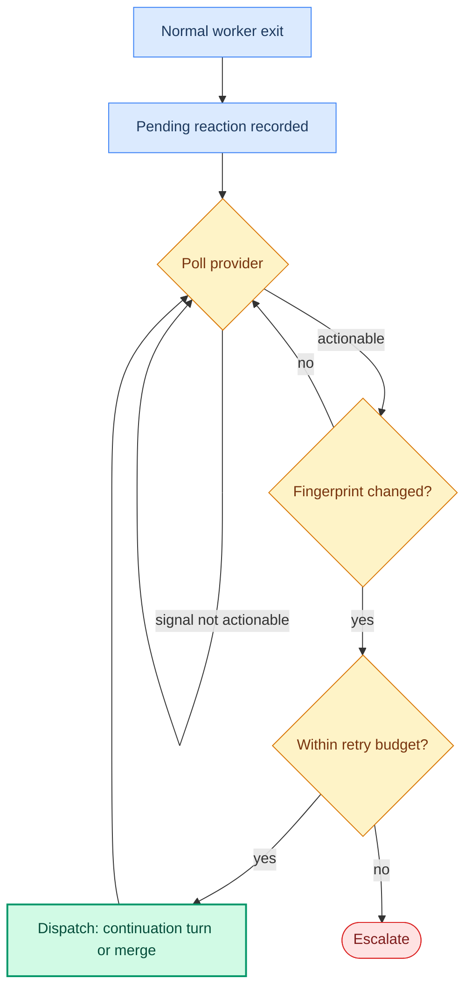

Reactions are feedback loops that respond to events on a Sortie-created pull request after the initial agent run hands off. Each reaction kind watches one external signal (failing CI, requested review changes, automated review-bot comments, a merge conflict against the PR's base branch, or a mergeable approved PR) and either dispatches a continuation turn so the agent can respond, or, for auto-merge, performs the merge directly. Reactions are opt-in: a kind is inactive until its `provider` is set, and omitting the `reactions` block disables all of them.

See also: [workflow configuration reference](/reference/workflow-config/) for the `reactions` block and the `tracker.handoff_state` and `tracker.active_states` fields; [state machine reference](/reference/state-machine/) for claims, retries, and the reconcile tick that drives reaction processing; [GitHub adapter reference](/reference/adapter-github/) for the SCM provider and token; [how to configure CI feedback](/guides/configure-ci-feedback/) and [how to configure PR review feedback](/guides/configure-review-feedback/) for setup procedures; [label commands reference](/reference/label-commands/) for the operator-applied `sortie:review` and `sortie:fix` labels, which fire on a human gesture rather than a PR event and are documented separately from these event-driven reactions.

---

## Reaction kinds at a glance

| Kind              | Watches                                   | Action                         | Budget field (default)         | Runtime kind |
| ----------------- | ----------------------------------------- | ------------------------------ | ------------------------------ | ------------ |
| `ci_failure`      | CI status on the PR branch                | Dispatches a continuation turn | `max_retries` (`2`)            | `ci`         |
| `review_comments` | Human `CHANGES_REQUESTED` review comments | Dispatches a continuation turn | `max_continuation_turns` (`3`) | `review`     |
| `bot_review`      | Automated review-bot comments             | Dispatches a continuation turn | `max_continuation_turns` (`5`) | `bot-review` |
| `merge_conflicts` | PR mergeability against the base          | Dispatches a rebase-and-resolve continuation turn | `max_retries` (`1`) | `merge-conflict` |
| `auto_merge`      | Merge preconditions on an approved PR     | Merges the PR directly         | `max_retries` (`2`)            | `merge`      |

---

## Reaction lifecycle

Every reaction kind moves through the same pipeline. The orchestrator records a *pending reaction* for an issue when a worker exits normally and SCM metadata is available, and it reconstructs eligible pending reactions at startup so feedback survives a restart. On each reconcile tick, after tracker-state refresh, the orchestrator runs the pipeline for each pending reaction in a fixed order: CI failure first, then review comments, then bot review, then merge conflict, then auto-merge.

1. **Poll.** The orchestrator queries the kind's provider for the current signal, throttled by the kind's `poll_interval_ms`. A transient fetch error re-enqueues the entry for the next tick.
2. **Fingerprint.** `review_comments`, `bot_review`, `merge_conflicts`, and `auto_merge` hash their salient state into a SHA-256 fingerprint stored in the `reaction_fingerprints` SQLite table. The review fingerprint is the sorted set of non-outdated comment IDs; the bot-review fingerprint is the sorted set of non-outdated bot comment IDs under its own kind row; the merge-conflict fingerprint is the PR head SHA; the merge fingerprint is the PR head SHA combined with the review decision. `ci_failure` computes no fingerprint and reads CI status directly.
3. **Deduplicate.** When the fingerprint matches the last value already marked dispatched, the tick takes no action. A new push or a changed comment set produces a new fingerprint and clears the dispatched mark. `ci_failure` deduplicates through status instead: a `pending` or `passing` conclusion takes no action, and a later `passing` result clears the issue's attempt counter.
4. **Dispatch.** The reaction action runs. For `ci_failure`, `review_comments`, `bot_review`, and `merge_conflicts` the orchestrator cancels any existing continuation retry and schedules a fix continuation turn, injecting the signal into the prompt through a continuation context variable. For `auto_merge` the orchestrator calls `MergePR` directly, since no code change is needed. Each dispatch increments the per-issue, per-kind attempt counter and uses a fixed 1-second delay rather than exponential backoff.
5. **Escalate.** When the attempt counter reaches the kind's retry budget, the orchestrator applies the configured `escalation` action and clears that kind's pending state. `ci_failure` and `review_comments` release the claim on escalation and stop. `auto_merge`, `bot_review`, and `merge_conflicts` scope cleanup to their own kind and keep the claim.



### Retry budgets

The attempt counter is tracked per issue and per kind. It resets when the issue leaves the running and retry maps, and `ci_failure` also resets it when CI returns to `passing`. The budget field differs by kind: `ci_failure` and `auto_merge` use `max_retries` (default `2`), `review_comments` uses `max_continuation_turns` (default `3`) as its hard cap, and `bot_review` uses `max_continuation_turns` (default `5`) as its hard cap. `merge_conflicts` uses `max_retries` (default `1`), the lowest of the kinds, and its counter is episodic, resetting when the conflict clears. A budget of `0` escalates `ci_failure` and `merge_conflicts` on the first actionable signal with no fix attempt. `auto_merge` is the exception: its escalation check requires `max_retries` greater than zero, so a budget of `0` turns count-based escalation off entirely instead of making it immediate. Polling is still bounded by the pending reaction's fixed 30-minute time-to-live, which is not configurable; once it elapses, the orchestrator drops the entry and logs a warning instead of escalating, so the reaction goes silent with no tracker-visible signal. An authentication-class or payload-class merge error still escalates `auto_merge` immediately regardless of the budget. To get near-immediate escalation on a failed merge, set `auto_merge.max_retries: 1`, the lowest budget its count-based check honors, which escalates after the first failed attempt.

### State eligibility

Reaction continuations dispatch even while the issue sits in the tracker's `handoff_state`, the state Sortie transitions to for human review after a successful run. This differs from fresh-work retries (stall recovery and transient agent errors), which dispatch only when the issue is in an `active_state`. An issue that has moved to any other state, including a terminal state, releases its claim on the next retry and runs no further reactions. See the [state machine reference](/reference/state-machine/) for the claim and retry model.

### Cross-kind isolation

Each kind owns its own pending entry, fingerprint row, and attempt counter. A successful auto-merge, or escalation of any one kind, scopes its cleanup to that kind alone and leaves the other kinds' state on the same issue intact. Because `auto_merge`, `bot_review`, and `merge_conflicts` keep the claim through that scoped cleanup, each re-arms and can escalate again if its condition recurs, while `ci_failure` and `review_comments` release the claim and stop after the first escalation.

### Escalation actions

When a kind exhausts its budget, the orchestrator applies one escalation action:

- `label` (default): adds `escalation_label` (default `needs-human`) to the tracker issue.
- `comment`: posts a plain-text tracker comment naming the PR, the attempt count, and the outstanding signal.

The action runs in a detached goroutine with a 30-second timeout. A failed escalation is logged and counted but does not block cleanup. CI escalation outcomes are recorded by the `sortie_ci_escalations_total` counter; see the [Prometheus metrics reference](/reference/prometheus-metrics/).

---

## Common fields

Every reaction kind shares these four fields.

| Field              | Type    | Default       | Description                                                                                     |
| ------------------ | ------- | ------------- | ----------------------------------------------------------------------------------------------- |
| `provider`         | string  | _(required)_  | SCM or CI adapter kind that activates the reaction (e.g. `github`). Must match a registered adapter. Absent or empty disables the kind, and all other fields in the sub-object are ignored. |
| `max_retries`      | integer | `2`           | Fix continuation dispatches per issue before escalation. Must be non-negative.                  |
| `escalation`       | string  | `label`       | Action on budget exhaustion. One of `label` or `comment`.                                       |
| `escalation_label` | string  | `needs-human` | Label applied to the tracker issue when `escalation` is `label`.                                |

Keys other than these four are kind-specific and listed under each kind below.

> [!NOTE]
> Environment variable overrides for `reactions` fields are not supported. Reaction configuration comes from `WORKFLOW.md`. The `provider` value takes effect at startup; the remaining fields take effect on the next dispatch after a dynamic reload.

---

## Reaction kinds

### `reactions.ci_failure`

Polls CI status for Sortie-created branches and dispatches a continuation turn when CI fails. This kind supersedes the deprecated top-level `ci_feedback` block; when both are present, `reactions.ci_failure` takes precedence and a deprecation warning is logged.

**Fields** (beyond the common fields):

| Field           | Type    | Default | Description                                                       |
| --------------- | ------- | ------- | ----------------------------------------------------------------- |
| `max_log_lines` | integer | `50`    | Maximum CI log tail lines injected into the prompt. `0` disables log injection. |

**Activation:** active when `provider` names a registered CI status provider. The orchestrator reads the CI ref from `.sortie/scm.json` (SHA preferred, branch as fallback).

**Behavior:** the reconcile loop fetches CI status each tick. A `pending` or `passing` status re-enqueues with no dispatch; a `passing` status also clears the attempt counter. A `failing` status increments the attempt counter and, while within `max_retries`, dispatches a continuation turn carrying the failing checks through the `.ci_failure` template variable. See the [`.ci_failure` template variable](/reference/workflow-config/#ci_failure) for its schema.

**Example:**

```yaml
reactions:
  ci_failure:
    provider: github
    max_retries: 2
    max_log_lines: 50
    escalation: label
    escalation_label: needs-human
```

### `reactions.review_comments`

Polls human `CHANGES_REQUESTED` review comments on Sortie-created PRs and dispatches a continuation turn so the agent can address the feedback. Bot and automated comments are filtered out by author type. This kind reads review state only; it does not create PRs, approve reviews, or resolve comments.

**Fields** (beyond the common fields):

| Field                    | Type    | Default  | Description                                                                                |
| ------------------------ | ------- | -------- | ------------------------------------------------------------------------------------------ |
| `poll_interval_ms`       | integer | `120000` | Minimum interval between review API polls per issue. Minimum: `30000`.                     |
| `debounce_ms`            | integer | `60000`  | Wait after the newest detected comment before dispatching. Must be non-negative.           |
| `max_continuation_turns` | integer | `3`      | Hard cap on review-triggered continuations per PR. Must be positive.                       |

**Activation:** active when `provider` names a registered SCM adapter. The agent or an `after_run` hook must write `pr_number` (positive integer), `owner`, and `repo` to `.sortie/scm.json` in the workspace. When any field is missing or zero, review polling is skipped for that workspace with no error.

**Behavior:** comments newer than `debounce_ms` defer dispatch until the reviewer's batch settles. The fingerprint is the SHA-256 of the sorted non-outdated comment IDs; a changed comment set triggers a new continuation, and an unchanged set is skipped. Dispatch injects the comments through the `.review_comments` template variable (a list of maps with keys `id`, `file`, `start_line`, `end_line`, `reviewer`, `body`). Escalation fires when the attempt counter reaches `max_continuation_turns`. See the [`.review_comments` template variable](/reference/workflow-config/#review_comments) for its schema.

**Example:**

```yaml
reactions:
  review_comments:
    provider: github
    max_retries: 2
    escalation: label
    escalation_label: needs-human
    poll_interval_ms: 120000
    debounce_ms: 60000
    max_continuation_turns: 3
```

### `reactions.bot_review`

Polls comments authored by automated review tools (linters, static analyzers, security scanners, and AI reviewers such as GitHub Copilot and CodeRabbit) on Sortie-created PRs and dispatches a continuation turn so the agent can address them. This is the complement of `review_comments`: that kind routes only human `CHANGES_REQUESTED` comments and filters bot-authored ones out, while `bot_review` routes the bot-authored ones. The runtime and persisted kind value for this reaction is `bot-review`, not `bot_review`.

**Fields** (beyond the common fields):

| Field                    | Type            | Default   | Description                                                                                                                                                  |
| ------------------------ | --------------- | --------- | ------------------------------------------------------------------------------------------------------------------------------------------------------------ |
| `poll_interval_ms`       | integer         | `60000`   | Minimum interval between bot-comment polls per issue. Minimum: `30000`. Tighter than `review_comments` (`120000`) because bot comments arrive in bulk right after a push rather than at reviewer pace. |
| `max_continuation_turns` | integer         | `5`       | Hard cap on bot-review continuations per PR. Must be positive. Higher than `review_comments` (`3`) because bot fixes are mechanical.                          |
| `bot_usernames`          | list of strings | _(empty)_ | Allowlist of bot logins, matched case-insensitively. Extends classification to review tools that comment under a regular user account. Empty by default, so only platform-typed bots match. |

**Activation:** active when `provider` names a registered SCM adapter, on its own, with no other `reactions` block required. The agent or an `after_run` hook must write `pr_number` (positive integer), `owner`, `repo`, and `branch` (all non-empty) to `.sortie/scm.json` in the workspace. When any field is missing or zero, bot-review polling is skipped for that workspace with no error.

**Classification:** bot authorship is deterministic author metadata, not comment content. A comment is selected when the platform reports a bot author type, or when its author login matches a `bot_usernames` entry (case-insensitive). No `CHANGES_REQUESTED` review state is required, because review bots commonly post comment-only reviews. The `bot_usernames` allowlist covers review tools that comment under a regular user account (`user.type == "User"`) rather than a bot account; Hound (`houndci-bot`) is the canonical example.

**No debounce:** bot comments dispatch on the tick they are detected. There is no `debounce_ms` field. This differs from `review_comments`, which waits out `debounce_ms` so a reviewer's batch settles; bot comments arrive in bulk on a push, so there is nothing to wait for.

**Fingerprint and dedup:** the fingerprint is the SHA-256 of the sorted non-outdated comment IDs, stored in `reaction_fingerprints` under a kind distinct from `review_comments`. A push that changes the bot comment-ID set produces a new fingerprint and re-triggers a continuation; an unchanged set that has already dispatched is skipped within the poll interval.

**Continuation context:** dispatch injects the comments through the `.bot_review_comments` template variable, a list of maps with keys `id`, `file`, `start_line`, `end_line`, `reviewer`, and `body`, where `reviewer` is the login of the bot that authored the comment. This is the same shape as `.review_comments`.

**Cross-kind isolation:** `bot_review` and `review_comments` never interfere on the same PR. Each owns its own pending entry, fingerprint row, and attempt counter.

**Escalation:** fires when the attempt counter reaches `max_continuation_turns`. The action is `label` (default) or `comment`, with `escalation_label` defaulting to `needs-human`. Cleanup is scoped to the `bot-review` kind and does not release the issue claim, so the reaction re-arms and can escalate again if bot comments recur on a long-lived PR. For that reason `escalation: comment` can accumulate repeated comments; prefer `label`. This differs from `ci_failure` and `review_comments`, whose escalation releases the claim and stops.

Bot-review checks and escalations are recorded by the `sortie_bot_review_checks_total{result}` and `sortie_bot_review_escalations_total{action}` counters when the HTTP server is enabled; see the [Prometheus metrics reference](/reference/prometheus-metrics/).

**Example:**

```yaml
reactions:
  bot_review:
    provider: github
    escalation: label
    escalation_label: needs-human
    poll_interval_ms: 60000
    max_continuation_turns: 5
    bot_usernames:            # only for review tools that comment under a user account, not a bot account
      - houndci-bot
```

### `reactions.merge_conflicts`

Polls the mergeability of open Sortie-managed PRs on every reconcile cycle and dispatches one rebase-and-resolve continuation turn when a PR transitions from no-conflict to conflict. The turn runs on the existing workspace and carries the PR's real base branch, read live from the PR object on the tick, so the agent rebases the head branch onto the PR's current target rather than an assumed default branch. The WORKFLOW.md key is `merge_conflicts` (plural); the runtime and persisted kind value is `merge-conflict` (singular, hyphenated); and the continuation context variable is `.merge_conflict` (singular).

**Fields** (beyond the common fields):

| Field              | Type    | Default | Description                                                                |
| ------------------ | ------- | ------- | -------------------------------------------------------------------------- |
| `poll_interval_ms` | integer | `60000` | Minimum interval between mergeability checks per issue. Minimum: `30000`.   |

Two common fields take kind-specific defaults here. `max_retries` defaults to `1`, not the common `2`, because a conflict that survives one rebase is unlikely to clear on a retry. `max_retries: 0` does not disable the kind; it escalates on the first detected conflict with no rebase attempt. To disable merge-conflict handling, omit the `merge_conflicts` block.

**Activation:** active when `provider` names a registered SCM adapter, on its own, with no other `reactions` block required. The agent or an `after_run` hook must write `pr_number` (positive integer), `owner`, `repo`, and `branch` (all non-empty) to `.sortie/scm.json` in the workspace. When any field is missing or zero, merge-conflict polling is skipped for that workspace with no error.

**Episodic retry:** the attempt counter is per episode. A resolved conflict (the PR returns to a non-conflicted state) resets the counter, so a later independent conflict opens a fresh episode and starts from zero rather than counting against the earlier budget. The default `max_retries` of `1` is the lowest of any kind for that reason.

**Detection:** conflict detection reads GitHub's `mergeable_state`. Only the `dirty` state is a conflict and arms a rebase turn; every other concrete state (`clean`, `unstable`, `blocked`, `behind`, and `draft`) closes the episode and resets the counter, and an `unknown` state defers to the next tick while GitHub finishes computing mergeability.

**Fingerprint and dedup:** the fingerprint is the SHA-256 of the PR head SHA, stored in `reaction_fingerprints` under a kind distinct from the other reactions. One conflicted head dispatches exactly one rebase turn. After the agent rebases and pushes a new head, the new head yields a new fingerprint and re-arms a fresh attempt bounded by `max_retries`; when the conflict clears, the row is deleted, so the next conflict observation dispatches again.

**Continuation context:** dispatch injects the `.merge_conflict` template variable, a map with keys `pr_number`, `branch` (the PR head branch the agent rebases), `head_sha` (the latest commit SHA on the head), and `base` (the PR's real target branch, read live, the rebase target).

**Coexistence with auto-merge:** `merge_conflicts` and `auto_merge` run independently on the same PR. Auto-merge defers while the PR is conflicted, merge-conflict drives the resolution, and once the PR is clean and approved auto-merge proceeds.

**Cross-kind isolation:** merge-conflict detection runs independently of every other reaction kind. Each owns its own pending entry, fingerprint row, and attempt counter.

**Escalation:** fires when the episode's attempt count exceeds `max_retries`. The action is `label` (default) or `comment`, with `escalation_label` defaulting to `needs-human`. Cleanup is scoped to the `merge-conflict` kind, removing its pending entry, fingerprint, and attempt counter; it does not release the issue claim, and other reaction kinds on the same issue are preserved.

Merge-conflict checks and escalations are recorded by the `sortie_merge_conflict_checks_total{result}` and `sortie_merge_conflict_escalations_total{action}` counters when the HTTP server is enabled; see the [Prometheus metrics reference](/reference/prometheus-metrics/).

**Example:**

```yaml
reactions:
  merge_conflicts:
    provider: github
    max_retries: 1
    escalation: label
    escalation_label: needs-human
    poll_interval_ms: 60000
```

### `reactions.auto_merge`

Polls merge preconditions on Sortie-created PRs and merges directly through the SCM adapter once they hold. Auto-merge is off by default and activates only when `provider` is set. There is no separate `enabled` flag; the presence of `provider` is the activation key, matching the other reaction kinds. The runtime and persisted kind value for this reaction is `merge`, not `auto_merge`.

**Fields** (beyond the common fields):

| Field              | Type    | Default  | Description                                                                                          |
| ------------------ | ------- | -------- | ---------------------------------------------------------------------------------------------------- |
| `strategy`         | string  | `squash` | Merge strategy. One of `merge`, `squash`, or `rebase`.                                               |
| `require_ci`       | boolean | `true`   | When `true`, every CI check must pass before the merge. When `false`, CI is advisory only.           |
| `delete_branch`    | boolean | `true`   | When `true`, the PR head branch is deleted after a successful merge. A delete failure does not roll back the merge. |
| `poll_interval_ms` | integer | `60000`  | Minimum interval between precondition checks per issue. Minimum: `30000`.                            |

**Activation:** active when `provider` names a registered SCM adapter. The agent or an `after_run` hook must write `pr_number`, `owner`, `repo`, and `branch` (all non-empty) to `.sortie/scm.json`. When `reactions.review_comments` is also configured, both kinds must name the same `provider`; a mismatch or an unknown provider fails startup. At startup the orchestrator runs a one-shot token-scope preflight: the merge endpoint needs `pull_requests:write`, branch deletion needs `contents:write`, and the classic `repo` scope covers both. An auth-class scope failure disables auto-merge for the process lifetime; a transport-class failure schedules one retry on the next tick before disabling.

**Merge preconditions:** the orchestrator merges only when all of the following hold. While any is unmet, the entry re-enqueues at the poll interval.

| Precondition   | Requirement for merge                                                              |
| -------------- | ---------------------------------------------------------------------------------- |
| Ownership      | The PR is Sortie-created, identified by `.sortie/scm.json`.                         |
| Draft state    | The PR is not a draft.                                                              |
| Mergeability   | GitHub reports `clean` or `unstable` (no conflicts).                                |
| Review         | The review decision is `APPROVED`, or reviews are not required (`NOT_REQUIRED`).    |
| CI             | The CI conclusion is `success` when `require_ci` is `true`; ignored when `false`.   |

**Behavior:** the merge fingerprint is the SHA-256 of the PR head SHA combined with the review decision, so a new push or a change in review decision allows a fresh attempt. `MergePR` is called with the expected head SHA to close the time-of-check to time-of-use window between the precondition read and the merge. A `409` response whose body reports the PR is already merged is treated as success. Escalation fires when the attempt counter reaches `max_retries`, but only when `max_retries` is greater than zero: a `max_retries` of `0` disables the count-based check instead of making it immediate. The pending reaction still expires after a fixed 30-minute time-to-live, not configurable; when it does, the orchestrator drops the entry and logs a warning rather than escalating, so the reaction goes silent with no tracker-visible signal. An authentication-class or payload-class merge error still escalates immediately regardless of the budget.

**Safety:** auto-merge acts on Sortie-created PRs only and never merges a draft. The merge is performed directly rather than through an agent turn.

> [!WARNING]
> A merge is irreversible. Sortie does not roll back on tail-step failures such as branch deletion or the confirmation comment. Auto-merge stays off unless `reactions.auto_merge.provider` is set, and enabling it is a conscious opt-in.

**Example** (conservative opt-in):

```yaml
reactions:
  review_comments:
    provider: github          # SCM provider; must match auto_merge below
  auto_merge:
    provider: github          # activates auto-merge; no separate "enabled" flag
    strategy: squash          # squash | merge | rebase
    require_ci: true          # never merge on failing or pending CI
    delete_branch: true       # remove the head branch after a successful merge
    max_retries: 2            # merge attempts before escalation
    escalation: comment       # post a tracker comment when attempts are exhausted
    poll_interval_ms: 60000   # 60s between precondition checks
```

---

## Validation rules

- Reaction kind keys must match `[a-z][a-z0-9_-]*`. Invalid keys are rejected with a configuration error.
- `max_retries` must be non-negative for all kinds.
- `escalation` must be `label` or `comment` for all kinds.
- `poll_interval_ms` must be at least `30000` for `review_comments` and `auto_merge`.
- `debounce_ms` must be non-negative, and `max_continuation_turns` must be positive, for `review_comments`.
- `poll_interval_ms` must be at least `30000` for `bot_review`.
- `max_continuation_turns` must be positive for `bot_review`.
- `bot_usernames` must be a list of strings for `bot_review`.
- `poll_interval_ms` must be at least `30000` for `merge_conflicts`.
- `strategy` for `auto_merge` must be `merge`, `squash`, or `rebase`.
- `require_ci` and `delete_branch` for `auto_merge` must be boolean.
- When `reactions.review_comments` and `reactions.auto_merge` are both present, they must declare the same `provider`.

`sortie validate` reports these errors before dispatch. See the [CLI reference](/reference/cli/) for the `validate` subcommand.
