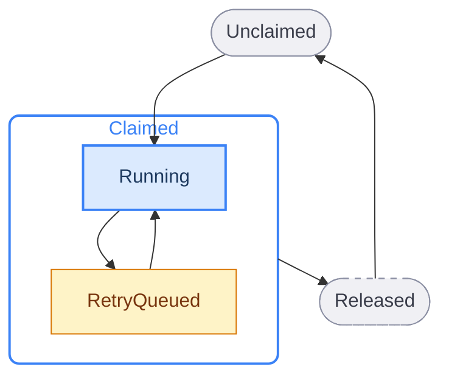
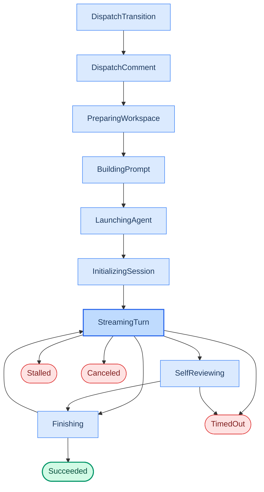

Sortie maintains two layers of state for every issue it processes. The **orchestration state** tracks whether the orchestrator has claimed the issue and what it is doing with it. The **run attempt phase** tracks where a single agent invocation stands within its lifecycle. These are independent from tracker states (`To Do`, `In Progress`) - they are Sortie's internal bookkeeping.

See also: [WORKFLOW.md configuration](/reference/workflow-config/) for `active_states`, `terminal_states`, `handoff_state`, and `in_progress_state`; [error reference](/reference/errors/) for error kinds that trigger retries; [CLI reference](/reference/cli/) for `--dry-run` mode that simulates dispatch without launching agents; [dashboard reference](/reference/dashboard/) for real-time visibility into orchestration state.

---

## Orchestration states

Every issue known to the orchestrator is in exactly one of five states. The orchestrator is the single authority for these transitions - no other component mutates scheduling state.

| State | Description |
|---|---|
| `Unclaimed` | The issue is not running and has no retry scheduled. Eligible for dispatch if it meets [candidate selection rules](#candidate-eligibility). |
| `Claimed` | The orchestrator has reserved the issue to prevent duplicate dispatch. A claimed issue is always either `Running` or `RetryQueued`. |
| `Running` | A worker goroutine exists for this issue. The issue is tracked in the `running` map with a live `RunningEntry`. |
| `RetryQueued` | No worker is running, but a retry timer exists. The issue remains claimed until the timer fires and either re-dispatches or releases. |
| `Released` | The claim has been removed. The issue is no longer tracked. This happens when the issue reaches a terminal tracker state, leaves the active state set, is missing from the tracker, or exhausts its retry path. |

### Transition details

**Unclaimed → Claimed.** Occurs during the dispatch phase of a poll tick. The issue must pass all [candidate eligibility](#candidate-eligibility) checks and a global or per-state concurrency slot must be available. The issue enters `Running` immediately - there is no `Claimed` without a worker.

**Running → RetryQueued.** Five worker exit outcomes lead here (the first two do not apply when a soft-stop signal is active; see [Claimed → Released](#transition-details) below):

- *Normal exit, issue still active, no soft-stop:* continuation retry after 1 000 ms fixed delay.
- *Normal exit, handoff fails, no soft-stop:* continuation retry after 1 000 ms.
- *Normal exit, handoff withheld by the [evidence policy](#handoff-evidence), no soft-stop:* exponential backoff retry (see [backoff formula](#backoff-formula)) - the only one of these five outcomes that takes exponential backoff from a normal exit rather than the fixed continuation delay.
- *Error exit, retryable:* exponential backoff retry (see [backoff formula](#backoff-formula)).
- *Stall timeout:* worker is killed; exponential backoff retry is scheduled.

An issue holds at most one queued retry. When any of these outcomes finds one already queued — a reaction continuation scheduled while the session was still running, for example — the queued entry is left in place and the claim is kept, rather than the queued work being replaced. The queued entry runs on its own timer, and the outcome that deferred to it takes no further action.

**RetryQueued → Running.** The retry timer fires. The orchestrator re-fetches candidates, confirms the issue is still eligible, acquires a slot, and launches a new worker. If no slot is available, the retry is rescheduled with the same backoff.

**Claimed → Released.** The claim is removed and no retry is scheduled:

- Reconciliation detects the tracker state is terminal or no longer in `active_states`.
- The retry timer fires but the issue is absent from the candidate list.
- The `max_sessions` budget is reached.
- The `max_tokens` token budget is reached.
- The worker error is classified as non-retryable.
- A `handoff_state` transition succeeds (the tracker now owns the issue).
- Soft-stop `blocked`: worker exits normally, claim released. No handoff transition, no continuation retry. Where the dispatch drives issue state, the issue is also parked with the escalation label and held out of dispatch until a release gesture. See [the parked-issue release rules](/concepts/agent-communication/).
- Soft-stop `needs-human-review`, handoff succeeds: worker exits normally, handoff transition performed, claim released.
- Soft-stop `needs-human-review`, handoff fails: worker exits normally, handoff fails, claim released without retry.
- The consecutive handoff-absence ceiling is reached: the claim is released and the issue is held out of dispatch until a release gesture. See [park issues stuck in a loop of empty runs](/guides/configure-retry-behavior/#park-issues-stuck-in-a-loop-of-empty-runs) for the ceiling and the three release gestures.

Two of these release only when the issue has no retry already queued: a successful `handoff_state` transition, and a normal exit on an issue that has since left the active states. A queued retry keeps the claim in both cases, so work queued while the session was running is not stranded.

**Released → Unclaimed.** A released issue can be re-dispatched on a future poll tick if its tracker state returns to an active state. The orchestrator does not remember previous releases - each poll tick evaluates eligibility from scratch.

---

## Run attempt phases

Each worker attempt progresses through a linear sequence of phases. Terminal phases end the attempt and produce a `WorkerResult` delivered to the orchestrator.

| Phase | Description |
|---|---|
| `DispatchTransition` | Optional. When [`tracker.in_progress_state`](/reference/workflow-config/) is configured, the worker calls `TransitionIssue` before workspace preparation. If the issue is already in the target state, the call is skipped (debug log only). Failure is non-fatal - the worker logs a warning and continues. |
| `DispatchComment` | Optional. When [`tracker.comments.on_dispatch`](/reference/workflow-config/) is `true`, the worker posts a tracker comment acknowledging that Sortie has claimed the issue. Fires after the dispatch transition and before workspace preparation. Failure is non-fatal - the worker logs a warning and continues. |
| `PreparingWorkspace` | Workspace directory is created or reused. `after_create` and `before_run` hooks execute. |
| `BuildingPrompt` | The `text/template` prompt body is rendered with issue data, attempt number, and turn context. |
| `LaunchingAgentProcess` | The agent adapter starts a session (subprocess, API call, or mock). |
| `InitializingSession` | Waiting for the `session_started` event from the agent adapter. |
| `StreamingTurn` | The agent is actively working. Token usage, tool calls, and status events stream in. |
| `SelfReviewing` | Optional. Entered only when [`self_review.enabled`](/reference/workflow-config/#self_review) is true and the coding turn loop finished successfully, not on turn failure. Runs review iterations until the turn budget is exhausted or the agent signals completion. |
| `Finishing` | The turn ended. `after_run` hooks execute. The worker checks whether to loop for another turn. |
| `Succeeded` | Terminal. The worker completed all turns without error. |
| `Failed` | Terminal. An error occurred during any earlier phase. |
| `TimedOut` | Terminal. The turn exceeded `agent.turn_timeout_ms`. |
| `Stalled` | Terminal. No agent event arrived within `agent.stall_timeout_ms`. Detected by reconciliation. |
| `CanceledByReconciliation` | Terminal. The worker's context was cancelled because the issue's tracker state became terminal or left the active set. |

Any phase from `PreparingWorkspace` through `StreamingTurn` can also transition to **Failed** on error; `SelfReviewing` can also transition to **TimedOut**, but only when a review or fix turn exceeds `agent.turn_timeout_ms`.

### Multi-turn behavior

A single worker attempt can execute multiple agent turns. After each turn:

1. The worker checks the tracker for the issue's current state.
2. If the state is still active and the turn count has not reached [`agent.max_turns`](/reference/workflow-config/), the worker loops back to `StreamingTurn`.
3. The first turn uses the full rendered prompt. Continuation turns send only continuation guidance to the existing agent thread.

---

## Tracker states the orchestrator writes

The orchestrator writes tracker state at exactly three points in an issue's life, each one a single named state drawn from configuration.

| Write | Trigger | Configured by |
|---|---|---|
| In-progress state | At dispatch, before workspace preparation. | `tracker.in_progress_state` |
| Handoff state | On a normal worker exit, with the issue still in an active state, the dispatch driving issue state, not a blocked soft stop, not already reported terminal, and not withheld by the [handoff-evidence verdict](#handoff-evidence). | `tracker.handoff_state` |
| Terminal state | When a Sortie-managed pull request merges while the linked issue is still parked in the handoff state. | `reactions.merge_completion.target_state` |

There are no other orchestrator-initiated tracker writes. What the orchestrator does besides these three carries no state semantics: the dispatch comment, the completion and failure comments, the auto-merge success comment, and a reaction's escalation label or comment are not transitions. The governing boundary is not between reading and writing, it is between a write that reports an event the orchestrator observed and a write that expresses a judgment about the work; the orchestrator makes only the first kind, so a case that turns on judgment, such as choosing between a completion state and an abandonment state for a pull request closed unmerged, is left to you or to the coding agent.

The coding agent has a path of its own, separate from these three: the [`tracker_api` tool](/reference/agent-extensions/#tracker_api) performs a `transition_issue` the agent asked for, within the configured project scope.

Each write stays off until its field is configured. The third is the newest and needs `reactions.merge_completion.provider` on top of its target state; a deployment that does not configure it sees no terminal write from the orchestrator at all.

The handoff write carries one extra guard, because it is the write most likely to race a person. If you close or cancel an issue while its final turn is still finishing, the handoff write would otherwise overwrite your decision with `handoff_state`. So the exit path tests the issue against `terminal_states` using the freshest observation it has, preferring one made by reconciliation, then one made by the worker's own per-turn refresh, then the state recorded at dispatch. A terminal observation suppresses the write, releases the claim, and cancels any pending retry. Because that observation can itself go stale while the worker tears down, Sortie performs one more state read immediately before the write and applies the same test. If that read fails, the write proceeds: an unreachable tracker is not evidence that the issue is closed. The read is skipped entirely when `terminal_states` is empty, since with no terminal state configured no value could classify as one and the call would cost a tracker request without ever suppressing anything. Only a terminal state suppresses. Any other state, including `handoff_state` itself when the agent already applied it through the `tracker_api` tool, leaves the write and everything downstream of it unchanged.

### Handoff evidence

The handoff write is subject to one further condition beyond the four in the table above: the run's handoff-evidence verdict, governed by [`tracker.handoff_evidence`](/reference/workflow-config/#tracker) (default `observed`). Sortie inspects the workspace the run used and returns one of three verdicts: work was observed, absence of work was observed, or evidence was not determinable. Work observed never withholds the write. Absence observed always withholds it, unless the policy is `off`. Not determinable withholds it only under `strict`.

| Policy | Work observed | Absence observed | Not determinable |
|---|---|---|---|
| `observed` (default) | Handoff proceeds | Withheld | Handoff proceeds |
| `strict` | Handoff proceeds | Withheld | Withheld |
| `off` | No verdict is computed; the four conditions above stand | n/a | n/a |

The default withholds only on a positively observed absence and abstains everywhere it cannot measure the workspace, the case a workspace that is not a Git work tree produces. A deployment whose workspaces are never version-controlled trees sees no behavioral change under the default and configures nothing. `strict` has no partial form: in such a deployment it withholds every transition and stops the pipeline, which is the operator's own choice to make.

One legitimate configuration is misread by the default. A primary dispatch whose entire product is a write to the tracker presents a measurable workspace and no movement in it, so it reads as an absence. A write made through the [`tracker_api` tool](/reference/agent-extensions/#tracker_api) goes straight to the tracker, not to the workspace, so it is invisible to the inspection above and cannot rescue the case. That is the case `off` exists for.

The verdict describes what survived the run, not whether the agent acted: it can withhold a handoff write and it can never cause one, and it cannot see work that was produced and then reverted. A withheld handoff records the run as failed, naming the verdict as the reason, even though the agent process exited normally.

This changes what a recorded run status of `succeeded` asserts: it no longer means only that the worker exited without error, but also that the system did not positively observe the run producing nothing. Rows recorded before this policy took effect, and any row recorded under the `off` policy, keep the older meaning and are not rewritten. A success rate computed across that boundary compares two different definitions of `succeeded`.

A continuation turn dispatched by a reaction runs as an ordinary agent session and so performs the same in-progress and handoff writes, while a session dispatched by a label command performs neither.

---

## Transition triggers

Seven external events drive state transitions. Each is handled by the orchestrator's single-writer event loop.

| Trigger | What happens |
|---|---|
| **Poll tick** | Reconcile running issues (stall detection + tracker state refresh). Run preflight validation. Fetch candidates. Sort by priority. Dispatch eligible issues until slots are exhausted. Dispatched workers perform the optional in-progress transition (via `tracker.in_progress_state`) and optional dispatch comment (via `tracker.comments.on_dispatch`) as their first steps. |
| **Worker exit (normal)** | Remove `running` entry. Persist run history to SQLite (a withheld handoff is recorded as `failed`, naming the verdict). Update token totals. Five outcome paths: (1) no soft-stop, issue active -- schedule continuation retry or perform handoff transition (retry on handoff failure); (2) soft-stop `blocked` -- release claim, no handoff, no retry, and park the issue with the escalation label where the dispatch drives issue state; (3) soft-stop `needs-human-review` -- perform handoff transition (if configured, issue active, and the dispatch drives issue state), release claim (no retry on handoff failure); (4) issue already reported terminal -- no handoff, release claim, no retry, no reactions enqueued; (5) handoff eligible but withheld by the [evidence policy](#handoff-evidence) -- no handoff transition, exponential backoff retry, or the issue is parked once the consecutive-absence ceiling is reached. Path 4 is tested ahead of paths 1, 3, and 5 and overrides them; path 5 is tested ahead of paths 1 and 3 and overrides them; path 2 is tested first of all. Post completion comment if [`tracker.comments.on_completion`](/reference/workflow-config/) is enabled (detached goroutine, non-blocking). |
| **Worker exit (error)** | Remove `running` entry. Persist run history. Classify error. If retryable, schedule exponential backoff retry. If not, release claim. Post failure comment if [`tracker.comments.on_failure`](/reference/workflow-config/) is enabled (detached goroutine, non-blocking). |
| **Agent update event** | Update live session fields: token counters, session ID, thread ID, agent PID, rate limits, last activity timestamp. |
| **Retry timer fired** | Re-fetch candidates. If the issue is still eligible and slots are available, dispatch. If no slots, reschedule. If the issue is gone or inactive, release claim. |
| **Reconciliation: tracker state refresh** | For each running issue: terminal state → cancel worker, clean workspace. Still active → update snapshot. Neither active nor terminal → cancel worker, no cleanup here; the [periodic sweep](#reconciliation) may still remove that workspace later on age. |
| **Reaction: managed PR observed as merged** | When [`reactions.merge_completion`](/reference/workflow-config/#reactionsmerge_completion) is configured, transition the linked issue to the configured terminal state, once per merge commit. No workspace or source-control side effect. |

---

## Candidate eligibility

An issue is eligible for dispatch when all conditions are true:

| Condition | Details |
|---|---|
| Required fields present | `id`, `identifier`, `title`, and `state` must be non-empty. |
| State is active | `state` is in `tracker.active_states` (case-insensitive). |
| State is not terminal | `state` is not in `tracker.terminal_states`. |
| Not running | `id` is not in the `running` map. |
| Not claimed | `id` is not in the `claimed` set. |
| Global slots available | `running_count < polling.max_concurrent_agents`. |
| Per-state slots available | Running count for this state < `polling.max_concurrent_agents_by_state[state]` (if configured). |
| Blockers resolved | No entry in `blocked_by` has a state that is in `active_states`. |

Issues are sorted for dispatch: priority ascending (nil last), `created_at` oldest first, `identifier` lexicographic tiebreaker.

---

## Backoff formula

Sortie uses two retry delay strategies depending on the exit type.

**Continuation retry** (normal worker exit, issue still active):

$$delay = 1000 \text{ ms}$$

**Error retry** (worker failure, stall timeout):

$$delay = \min(10000 \times 2^{(attempt - 1)},\ \text{max\_retry\_backoff\_ms})$$

Default `max_retry_backoff_ms`: 300 000 (5 minutes). Configurable via [`agent.max_retry_backoff_ms`](/reference/workflow-config/).

| Attempt | Delay |
|---|---|
| 1 | 10 s |
| 2 | 20 s |
| 3 | 40 s |
| 4 | 80 s |
| 5 | 160 s |
| 6+ | 300 s (cap) |

When a retry fires but no concurrency slot is available, the retry is rescheduled at the same backoff level with error `no available orchestrator slots`.

---

## Reconciliation

Reconciliation runs at the start of every poll tick, before dispatch. It has two parts.

**Part A - Stall detection.** For each running issue, compute elapsed time since the last agent event (or `started_at` if no event has arrived). If elapsed exceeds [`agent.stall_timeout_ms`](/reference/workflow-config/), the worker is killed and an exponential backoff retry is scheduled. Disabled when `stall_timeout_ms` is zero or negative.

**Part B - Tracker state refresh.** Fetch current tracker states for all running issue IDs.

| Tracker reports | Action |
|---|---|
| Terminal state | Cancel worker. Mark workspace for cleanup after worker exits. |
| Still active | Update the in-memory issue snapshot. Worker continues. |
| Neither active nor terminal | Cancel worker. No workspace cleanup here; the periodic sweep may remove that workspace later on age. |
| Fetch fails | Keep all workers running. Retry on next tick. |

**Periodic workspace sweep.** Separately from the per-tick reconciliation above, a sweep runs once every 60 poll ticks and applies two grounds in one pass. The terminal check runs first: it asks the tracker for the state of every workspace key on disk that does not belong to in-flight work, and removes those reported terminal. Whatever it leaves is then evaluated against [`workspace.retention_days`](/reference/workflow-config/#workspace), an opt-in age bound that is off by default and needs no answer from the tracker, so it still removes on a pass where the tracker read failed.

---

## Recovery at startup

When Sortie starts (or restarts after a crash), it reconstructs orchestration state from SQLite and the tracker.

1. Open SQLite database and apply schema migrations.
2. Load persisted retry entries. Reconstruct retry timers from stored `due_at` timestamps.
3. Enumerate workspace directories on disk and map directory names to issue identifiers.
4. Query the tracker for the states of those identifiers and remove the workspace directories of issues reported terminal. Only keys whose state is both known and terminal are removed, so a workspace whose issue is missing from the response or sits in a non-active, non-terminal state survives the pass. No age-based removal runs at startup.
5. Query the tracker for active issues. Reconcile with persisted state.
6. Begin the normal poll loop.

If the workspace listing or the terminal-state query fails at startup, Sortie logs a warning, cleans nothing on that pass, and continues. For an issue with no running worker, terminal cleanup then waits for the [periodic sweep](#reconciliation), which is also where the opt-in age bound in [`workspace.retention_days`](/reference/workflow-config/#workspace) applies.
