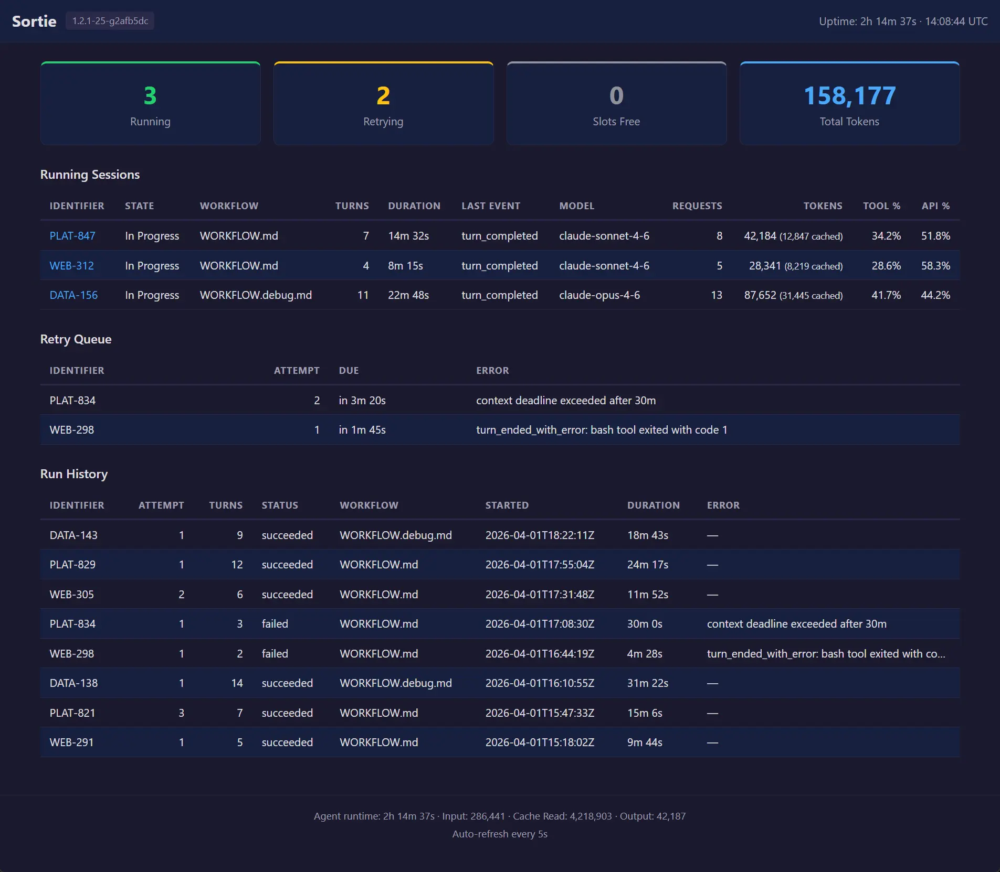

# Dashboard reference

Sortie ships a self-contained HTML dashboard at `/` on the same port as the [JSON API](http-api.md) and [Prometheus metrics](prometheus-metrics.md). No external tools, no JavaScript frameworks, no CDN dependencies — one HTML page rendered server-side by Go's `html/template` engine.

The dashboard is designed for local, at-a-glance monitoring. Open it in a browser while Sortie runs, and you see what is happening right now: which agents are working, how many tokens they have consumed, what is waiting for retry, and how past runs ended. It auto-refreshes every 5 seconds via an HTML `<meta http-equiv="refresh">` tag — no WebSocket, no polling script.

The dashboard supports light and dark modes automatically via `prefers-color-scheme`. No toggle is needed.



## Enabling the dashboard

The dashboard is available when the HTTP server is enabled. Pass `--port` at launch:

```sh
sortie --port 8080 WORKFLOW.md
```

Or set `server.port` in the WORKFLOW.md front matter:

```yaml
---
server:
  port: 8080
---
```

Then open `http://127.0.0.1:8080/` in a browser.

For the full `server` extension schema, see [WORKFLOW.md configuration reference](workflow-config.md).

## Network access

Sortie binds to `127.0.0.1` only. The dashboard is accessible on the machine where Sortie is running — not from other hosts on the network. This is intentional: Sortie is a local orchestration tool, and the dashboard is a local monitoring surface.

If you need remote access to the dashboard — for example, when running Sortie on a cloud VM — place a reverse proxy such as Nginx in front of it and forward traffic to the local port. This is a standard deployment pattern but falls outside Sortie's scope. Secure the proxy with authentication; Sortie's HTTP server has no built-in auth.

For production monitoring across multiple hosts, use the [Prometheus `/metrics` endpoint](prometheus-metrics.md) with a Prometheus server and [Grafana](https://prometheus.io/docs/visualization/grafana/) dashboards. Prometheus is built for aggregated, historical, alertable monitoring — the dashboard is not.

## Header

The top bar displays:

| Element | Description |
|---|---|
| **Sortie** | Application name. |
| Version badge | Build version string (e.g., `1.3.0`). Shows `dev` when running an untagged build. |
| Uptime | Wall-clock time since the process started, formatted as `Xd Xh Xm` or `Xh Xm Xs`. |
| Timestamp | UTC time when the snapshot was generated, in `HH:MM:SS UTC` format. |

## Summary cards

Four cards across the top provide the high-level picture.

| Card | Color | Value | Description |
|---|---|---|---|
| **Running** | Green | Integer | Number of agent sessions currently executing. Maps to `sortie_sessions_running` in [Prometheus](prometheus-metrics.md). |
| **Retrying** | Yellow | Integer | Number of issues in the retry queue — waiting for their next attempt after an error, continuation, or stall timeout. Maps to `sortie_sessions_retrying`. |
| **Slots Free** | Gray | Integer | Remaining dispatch capacity: `max_concurrent_agents − running`. When this reaches 0, the orchestrator waits for a running session to finish before dispatching the next issue. |
| **Total Tokens** | Blue | Integer (comma-formatted) | Cumulative LLM tokens consumed across all sessions since startup. Includes input, output, and cache-read tokens. |

## Running sessions table

Lists every agent session that is actively executing. Sorted by start time (oldest first). Each row links to the [per-issue JSON detail endpoint](http-api.md#get-apiv1identifier-issue-detail).

| Column | Description |
|---|---|
| **Identifier** | Issue identifier (e.g., `MT-649`). Clicking the link opens `GET /api/v1/{identifier}` in the browser. |
| **State** | Current orchestrator state for this issue (e.g., `agent_running`). |
| **Workflow** | Name of the WORKFLOW.md file that dispatched this session. Shows an em dash when unavailable. |
| **Host** | SSH host where the agent is running. This column appears only when at least one session uses an SSH host. Shows `local` for sessions running on the same machine as Sortie. |
| **Turns** | Number of agent turns completed in this session. A turn is one prompt–response cycle. |
| **Duration** | Wall-clock time since the session started, formatted as `Xh Xm Xs` or `Xm Xs`. |
| **Last Event** | Most recent agent event type received (e.g., `result`, `tool_use`). |
| **Model** | LLM model name reported by the agent (e.g., `claude-sonnet-4-20250514`). Shows an em dash when the agent has not reported a model. |
| **Requests** | Number of API requests the agent has made to the LLM provider. |
| **Tokens** | Total tokens consumed by this session. When cache-read tokens are nonzero, they appear in parentheses (e.g., `12,450 (8,200 cached)`). |
| **Tool %** | Percentage of elapsed wall-clock time the agent spent in tool calls. Shows `N/A` until the session has both elapsed time and recorded tool time. |
| **API %** | Percentage of elapsed wall-clock time the agent spent waiting for LLM API responses. Shows `N/A` until both elapsed time and API time are recorded. |

When no sessions are running, the table is replaced with a centered "No running sessions" message.

## Retry queue table

Lists issues that are waiting for their next session attempt. Sorted by due time (soonest first).

| Column | Description |
|---|---|
| **Identifier** | Issue identifier. |
| **Attempt** | The attempt number for the upcoming retry (e.g., `2` means the first attempt failed and this is the second try). |
| **Due** | Time until the retry fires, relative to the snapshot timestamp. Shows `in Xm Xs`, `now`, or `overdue`. |
| **Error** | Error message from the previous failed attempt. Truncated with ellipsis in the table cell; hover to see the full text in a tooltip. |

When no retries are pending, the table is replaced with "No retries pending."

## Run history table

Lists recently completed session attempts — both successful and failed. Shows the last 25 entries. This section appears only when run history data is available (requires persistence to be enabled).

| Column | Description |
|---|---|
| **Identifier** | Issue identifier. |
| **Attempt** | Which attempt number completed (1-based). The first dispatch is `1`, the first retry is `2`, and so on. |
| **Turns** | Number of agent turns completed in this session. A turn is one prompt–response cycle. |
| **Status** | Outcome of the attempt (e.g., `completed`, `error`, `cancelled`). |
| **Workflow** | WORKFLOW.md file used for this run. Shows an em dash when unavailable. |
| **Started** | RFC 3339 timestamp when the session started. |
| **Duration** | Wall-clock time from start to completion. Computed from the start and completion timestamps. |
| **Error** | Error message, if the attempt failed. Shows an em dash for successful attempts. |

## Footer

The footer displays aggregate statistics across all sessions since startup:

| Element | Description |
|---|---|
| **Agent runtime** | Cumulative wall-clock time agents have spent running, formatted as `Xh Xm Xs`. |
| **Input** | Total input tokens consumed (comma-formatted). |
| **Cache** | Total cache-read tokens (comma-formatted). |
| **Output** | Total output tokens consumed (comma-formatted). |
| **Auto-refresh** | Reminder that the page refreshes every 5 seconds. |

## Temporary unavailability

If the orchestrator's state snapshot fails (e.g., during shutdown), the dashboard returns HTTP 503 with a minimal HTML page that reads "Dashboard temporarily unavailable" and auto-refreshes in 5 seconds. No manual reload is needed.

If the Go template execution fails (an internal error), the dashboard returns HTTP 500 with a similarly minimal auto-refreshing error page.
