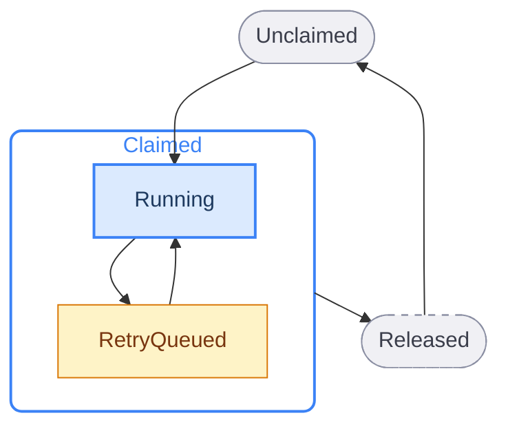
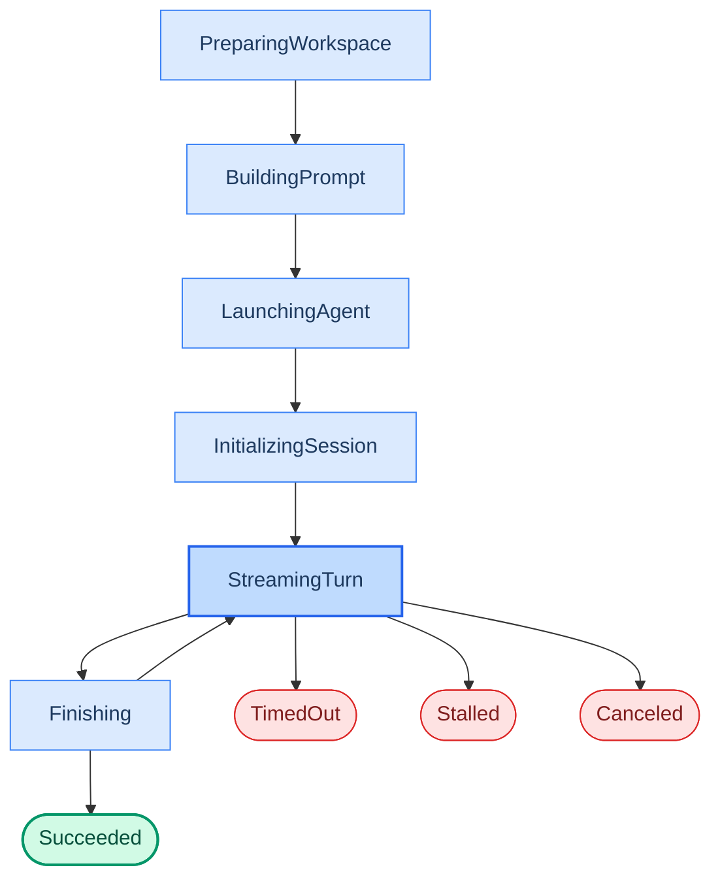

# State machine reference

Sortie maintains two layers of state for every issue it processes. The **orchestration state** tracks whether the orchestrator has claimed the issue and what it is doing with it. The **run attempt phase** tracks where a single agent invocation stands within its lifecycle. These are independent from tracker states (`To Do`, `In Progress`) — they are Sortie's internal bookkeeping.

See also: [WORKFLOW.md configuration](workflow-config.md) for `active_states`, `terminal_states`, and `handoff_state`; [error reference](errors.md) for error kinds that trigger retries; [CLI reference](cli.md) for `--dry-run` mode that simulates dispatch without launching agents; [dashboard reference](dashboard.md) for real-time visibility into orchestration state.

---

## Orchestration states

Every issue known to the orchestrator is in exactly one of five states. The orchestrator is the single authority for these transitions — no other component mutates scheduling state.

| State | Description |
|---|---|
| `Unclaimed` | The issue is not running and has no retry scheduled. Eligible for dispatch if it meets [candidate selection rules](#candidate-eligibility). |
| `Claimed` | The orchestrator has reserved the issue to prevent duplicate dispatch. A claimed issue is always either `Running` or `RetryQueued`. |
| `Running` | A worker goroutine exists for this issue. The issue is tracked in the `running` map with a live `RunningEntry`. |
| `RetryQueued` | No worker is running, but a retry timer exists. The issue remains claimed until the timer fires and either re-dispatches or releases. |
| `Released` | The claim has been removed. The issue is no longer tracked. This happens when the issue reaches a terminal tracker state, leaves the active state set, is missing from the tracker, or exhausts its retry path. |

### Transition details

**Unclaimed → Claimed.** Occurs during the dispatch phase of a poll tick. The issue must pass all [candidate eligibility](#candidate-eligibility) checks and a global or per-state concurrency slot must be available. The issue enters `Running` immediately — there is no `Claimed` without a worker.

**Running → RetryQueued.** Three worker exit outcomes lead here:

- *Normal exit, issue still active:* continuation retry after 1 000 ms fixed delay.
- *Normal exit, handoff fails:* continuation retry after 1 000 ms.
- *Error exit, retryable:* exponential backoff retry (see [backoff formula](#backoff-formula)).
- *Stall timeout:* worker is killed; exponential backoff retry is scheduled.

**RetryQueued → Running.** The retry timer fires. The orchestrator re-fetches candidates, confirms the issue is still eligible, acquires a slot, and launches a new worker. If no slot is available, the retry is rescheduled with the same backoff.

**Claimed → Released.** The claim is removed and no retry is scheduled:

- Reconciliation detects the tracker state is terminal or no longer in `active_states`.
- The retry timer fires but the issue is absent from the candidate list.
- The `max_sessions` budget is reached.
- The worker error is classified as non-retryable.
- A `handoff_state` transition succeeds (the tracker now owns the issue).

**Released → Unclaimed.** A released issue can be re-dispatched on a future poll tick if its tracker state returns to an active state. The orchestrator does not remember previous releases — each poll tick evaluates eligibility from scratch.

---

## Run attempt phases

Each worker attempt progresses through a linear sequence of phases. Terminal phases end the attempt and produce a `WorkerResult` delivered to the orchestrator.

| Phase | Description |
|---|---|
| `PreparingWorkspace` | Workspace directory is created or reused. `after_create` and `before_run` hooks execute. |
| `BuildingPrompt` | The `text/template` prompt body is rendered with issue data, attempt number, and turn context. |
| `LaunchingAgentProcess` | The agent adapter starts a session (subprocess, API call, or mock). |
| `InitializingSession` | Waiting for the `session_started` event from the agent adapter. |
| `StreamingTurn` | The agent is actively working. Token usage, tool calls, and status events stream in. |
| `Finishing` | The turn ended. `after_run` hooks execute. The worker checks whether to loop for another turn. |
| `Succeeded` | Terminal. The worker completed all turns without error. |
| `Failed` | Terminal. An error occurred during any earlier phase. |
| `TimedOut` | Terminal. The turn exceeded `agent.turn_timeout_ms`. |
| `Stalled` | Terminal. No agent event arrived within `agent.stall_timeout_ms`. Detected by reconciliation. |
| `CanceledByReconciliation` | Terminal. The worker's context was cancelled because the issue's tracker state became terminal or left the active set. |

Any phase from `PreparingWorkspace` through `StreamingTurn` can also transition to **Failed** on error. The specific error trigger for each phase is documented in the table above.

### Multi-turn behavior

A single worker attempt can execute multiple agent turns. After each turn:

1. The worker checks the tracker for the issue's current state.
2. If the state is still active and the turn count has not reached [`agent.max_turns`](workflow-config.md), the worker loops back to `StreamingTurn`.
3. The first turn uses the full rendered prompt. Continuation turns send only continuation guidance to the existing agent thread.

---

## Transition triggers

Six external events drive state transitions. Each is handled by the orchestrator's single-writer event loop.

| Trigger | What happens |
|---|---|
| **Poll tick** | Reconcile running issues (stall detection + tracker state refresh). Run preflight validation. Fetch candidates. Sort by priority. Dispatch eligible issues until slots are exhausted. |
| **Worker exit (normal)** | Remove `running` entry. Persist run history to SQLite. Update token totals. Schedule continuation retry or perform handoff transition. |
| **Worker exit (error)** | Remove `running` entry. Persist run history. Classify error. If retryable, schedule exponential backoff retry. If not, release claim. |
| **Agent update event** | Update live session fields: token counters, session ID, thread ID, agent PID, rate limits, last activity timestamp. |
| **Retry timer fired** | Re-fetch candidates. If the issue is still eligible and slots are available, dispatch. If no slots, reschedule. If the issue is gone or inactive, release claim. |
| **Reconciliation: tracker state refresh** | For each running issue: terminal state → cancel worker, clean workspace. Still active → update snapshot. Neither active nor terminal → cancel worker, no cleanup. |

---

## Candidate eligibility

An issue is eligible for dispatch when all conditions are true:

| Condition | Details |
|---|---|
| Required fields present | `id`, `identifier`, `title`, and `state` must be non-empty. |
| State is active | `state` is in `tracker.active_states` (case-insensitive). |
| State is not terminal | `state` is not in `tracker.terminal_states`. |
| Not running | `id` is not in the `running` map. |
| Not claimed | `id` is not in the `claimed` set. |
| Global slots available | `running_count < polling.max_concurrent_agents`. |
| Per-state slots available | Running count for this state < `polling.max_concurrent_agents_by_state[state]` (if configured). |
| Blockers resolved | No entry in `blocked_by` has a state that is in `active_states`. |

Issues are sorted for dispatch: priority ascending (nil last), `created_at` oldest first, `identifier` lexicographic tiebreaker.

---

## Backoff formula

Sortie uses two retry delay strategies depending on the exit type.

**Continuation retry** (normal worker exit, issue still active):

$$delay = 1000 \text{ ms}$$

**Error retry** (worker failure, stall timeout):

$$delay = \min(10000 \times 2^{(attempt - 1)},\ \text{max\_retry\_backoff\_ms})$$

Default `max_retry_backoff_ms`: 300 000 (5 minutes). Configurable via [`agent.max_retry_backoff_ms`](workflow-config.md).

| Attempt | Delay |
|---|---|
| 1 | 10 s |
| 2 | 20 s |
| 3 | 40 s |
| 4 | 80 s |
| 5 | 160 s |
| 6+ | 300 s (cap) |

When a retry fires but no concurrency slot is available, the retry is rescheduled at the same backoff level with error `no available orchestrator slots`.

---

## Reconciliation

Reconciliation runs at the start of every poll tick, before dispatch. It has two parts.

**Part A — Stall detection.** For each running issue, compute elapsed time since the last agent event (or `started_at` if no event has arrived). If elapsed exceeds [`agent.stall_timeout_ms`](workflow-config.md), the worker is killed and an exponential backoff retry is scheduled. Disabled when `stall_timeout_ms` is zero or negative.

**Part B — Tracker state refresh.** Fetch current tracker states for all running issue IDs.

| Tracker reports | Action |
|---|---|
| Terminal state | Cancel worker. Mark workspace for cleanup after worker exits. |
| Still active | Update the in-memory issue snapshot. Worker continues. |
| Neither active nor terminal | Cancel worker. No workspace cleanup. |
| Fetch fails | Keep all workers running. Retry on next tick. |

---

## Recovery at startup

When Sortie starts (or restarts after a crash), it reconstructs orchestration state from SQLite and the tracker.

1. Open SQLite database and apply schema migrations.
2. Load persisted retry entries. Reconstruct retry timers from stored `due_at` timestamps.
3. Enumerate workspace directories on disk and map directory names to issue identifiers.
4. Query the tracker for terminal-state issues among those with existing workspaces. Remove stale workspace directories.
5. Query the tracker for active issues. Reconcile with persisted state.
6. Begin the normal poll loop.

If the terminal-issue query fails at startup, Sortie logs a warning and continues — workspace cleanup is deferred to the next successful reconciliation.
